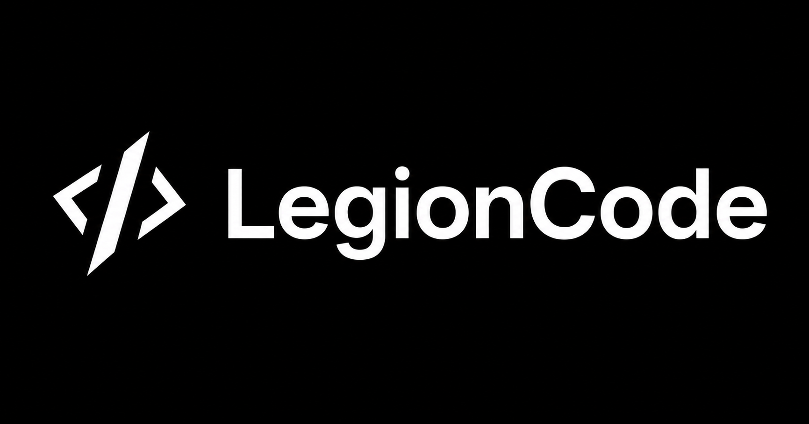
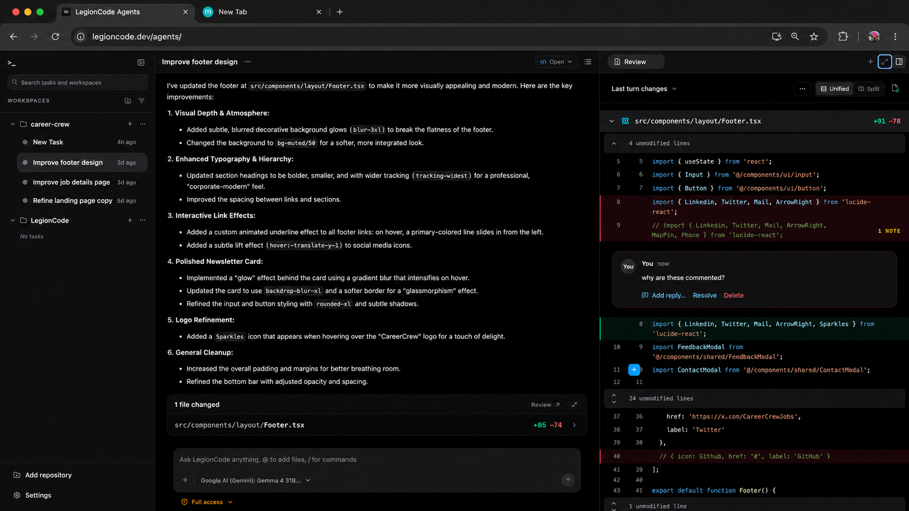

<div align="center">
  

  <p><strong>An open-source coding-agent workspace for running tasks and reviewing code changes.</strong></p>

  <p>
    <a href="https://legioncode.dev/">Website</a> ·
    <a href="https://legioncode.dev/cloud/">Request private-alpha access</a> ·
    <a href="https://legioncode.dev/docs/">Documentation</a>
  </p>

  <p>
    
    <a href="LICENSE"></a>
  </p>
</div>

> [!IMPORTANT]
> **LegionCode is open source. LegionCode Cloud is in private alpha.** The current build demonstrates a complete coding-task workflow with task history and diff review. Reliability, execution isolation, and parallel-agent workflows are actively being rebuilt. It is not yet intended for production or sensitive repositories.



## What is LegionCode?

LegionCode is an open-source workspace where coding agents work on your GitHub repositories. Give an agent a task, follow its work, and review every code change before you use it.

## Private alpha today

- Connect a GitHub repository and your preferred model provider.
- Run a coding task and follow the agent's progress.
- Review changed files, inspect diffs, and leave inline feedback.

## In development

- Reliable isolated execution for every run.
- Parallel coding-agent workspaces.
- Predictable recovery for failed and interrupted runs.
- Durable task lifecycle across clients.
- Desktop and CLI clients.
- A public SDK and additional agent-harness adapters.

## Try LegionCode Cloud

Access to the hosted private alpha is approved in limited batches. Use a test repository or disposable branch, keep backups, and review every generated change.

To try the hosted alpha:

1. [Request access](https://legioncode.dev/cloud/) using the email associated with your GitHub account.
2. After approval, sign in with GitHub and connect a repository.
3. Add your model provider, submit a scoped task, and review the resulting diff.

## Architecture

LegionCode separates its browser interface, agent orchestration, and code-execution boundary:

```text
Web workspace → Brain → Secure agent API → Cloudflare Sandbox
                       ↘ Durable Objects for run state
```

The Web app owns task control and review. Brain coordinates models, tools, and streaming responses. The secure-agent API performs filesystem, command, and Git operations inside a run-scoped workspace. Durable Objects retain orchestration and execution state.

```text
apps/
  web/               React + Vite control and review interface
  brain/             Agent orchestration and public API boundary
  secure-agent-api/  Sandbox execution, Git operations, and run state

packages/
  execution-engine/  Runtime execution policy and adapters
  shared-types/      Cross-application contracts
```

Each execution is identified by a `runId`, which scopes its runtime state and workspace.

## Run locally

### Prerequisites

- Node.js `>=18`
- pnpm `>=9`

Local development is currently being stabilized. See the [local development guide](https://legioncode.dev/docs/local-development/) for required environment variables, Cloudflare bindings, app-specific commands, and verification steps.

## Contributing

LegionCode is evolving quickly. Contributions that improve runtime reliability, lifecycle correctness, and the end-to-end coding workflow are welcome. Please read [CONTRIBUTING.md](CONTRIBUTING.md) before opening a pull request.

- Report vulnerabilities through the process in [SECURITY.md](SECURITY.md).
- Review the project standards in [CODE_OF_CONDUCT.md](CODE_OF_CONDUCT.md).

## License

LegionCode is released under the [MIT License](LICENSE).
